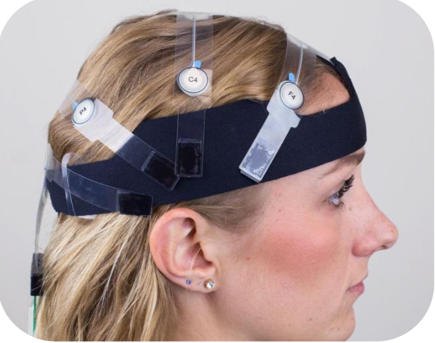
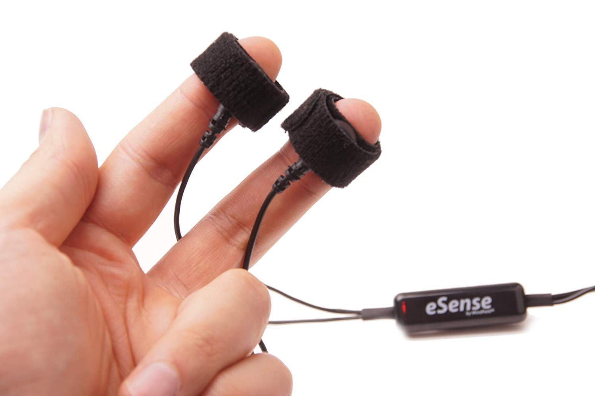

  <h1>🎮 Multimodale Evaluierung eines Serious Games zum Thema Klimawandel</h1>

  
Im Rahmen eines Dissertationsprojekts untersuchen wir, wie sich ein Serious Game auf deinen Lernerfolg auswirkt. 
  Weitere Infos zum Ablauf, den von uns verwendeten Sensoren etc. findest du in den <a href="#details">detaillierten Informationen zur Studie</a>.

  
<strong>📍Wo &amp; Wann?</strong> 
  Die Studie findet vor Ort am Campus Südstadt der TH Köln (Claudiusstraße 1) statt und dauert maximal 90 Minuten.

  
<strong>🎁 Was hast du davon?</strong>

  <ul>
    <li><strong>Gewinne</strong> einen von drei <strong>50€ Wunschgutscheinen</strong>!</li>
    <li>Lerne spielend mehr über den Klimawandel</li>
    <li>Erfahre hautnah, wie eine wissenschaftliche Studie abläuft und lerne die eingesetzten Sensoren kennen</li>
  </ul>

  
<strong>👥 Wer kann teilnehmen?</strong>

  <ul>
    <li>Jede*r Interessierte ist willkommen! Vorkenntnisse sind nicht erforderlich.</li>
    <li>Aus Sicherheitsgründen ist die Teilnahme leider nicht möglich, wenn du einen Herzschrittmacher hast.</li>
  </ul>

  
<strong>🔒 Datenschutz</strong> 
  Deine Daten werden streng vertraulich behandelt und nur für Forschungszwecke genutzt. Die ausführliche <a href="#datenschutz">Datenschutzerklärung</a> findest du ebenfalls hier auf der Seite.

  

    <a href="https://zeeg.me/leoniekallabis/sg" class="btn-primary" target="_blank" rel="noopener">📅Termin buchen</a>
  

  <h1>Detaillierte Informationen zur Studie</h1>

  <h2>Zweck der Studie</h2>
  
Im Rahmen eines Dissertationsprojekts untersuchen wir, wie sich ein Serious Game auf deinen Lernerfolg auswirkt. Das Serious Game befasst sich mit dem Thema Klimawandel.

  <h2>Ablauf der Studie</h2>
  <ol>
    <li><strong>Begrüßung &amp; Standort</strong> Du kommst am Haupteingang der TH Köln Campus Südstadt an. Die Studienleitung (Leonie Kallabis) wird dich abholen und zum Labor begleiten.</li>
    <li><strong>Datenschutz und Einwilligung</strong> Im Labor gehen wir gemeinsam die Datenschutzerklärung durch. Bitte wirf vorab schon einen Blick darauf (<a href="#datenschutz">Datenschutzerklärung</a>). Nach deiner Einwilligung starten wir mit dem Anlegen der Sensoren.</li>
    <li><strong>Sensoren anlegen</strong> 
      <ul>
        <li>Elektroenzephalografie (EEG) Sensoren werden vorsichtig am Kopf und Schlüsselbein befestigt.</li>
        <li>Hautleitwertmessung (EDA) erfolgt mit zwei Sensoren an einem Finger deiner rechten Hand.</li>
        <li>Zur besseren Erfassung verwenden wir Elektrodenkontaktpaste, die mit Haut und Haaren in Kontakt kommt.</li>
      </ul>
      

        
        
      

    </li>
    <li><strong>Studienablauf am PC</strong> 
      <ul>
        <li>Zuerst führen wir einen Test zur Verwendung der EEG Sensoren durch.</li>
        <li>Anschließend kalibrieren wir das Eyetracking, welches deine Blickdaten während der Studie erfasst.</li>
        <li>Danach beantwortest du mehrere Fragebögen zu demografischen Daten, Emotionen, deinem Wissen und deiner Einstellung zum Klimawandel sowie zu deiner Videospielexpertise.</li>
        <li>Im Anschluss spielst du das Serious Game.</li>
        <li>Nach dem Spiel beantwortest du weitere Fragen.</li>
      </ul>
    </li>
    <li><strong>Abschluss</strong> Nachdem du die letzten Fragebögen ausgefüllt hast, entfernen wir die Sensoren. Damit ist die Studie abgeschlossen.</li>
  </ol>

  <h2>Mögliche Risiken &amp; Unannehmlichkeiten</h2>
  
Das Spiel thematisiert den Klimawandel. Dies kann Gefühle wie Angst, Hilflosigkeit oder Sorge („Eco-Anxiety“) auslösen. Bitte nimm nur an der Studie teil, wenn du dich mit diesem Thema wohlfühlst.

  <ul>
    <li>Du musst damit einverstanden sein, dass dich die Studienleitung vorsichtig am Kopf und Schlüsselbein für die EEG-Sensoren sowie an der rechten Hand für die EDA-Sensoren berührt.</li>
    <li>Die Elektrodenkontaktpaste kann Rückstände auf Haut und Haaren hinterlassen, die sich jedoch leicht entfernen lassen.</li>
    <li>Du kannst deine Teilnahme jederzeit und ohne Angabe von Gründen abbrechen, ohne dass dir daraus Nachteile entstehen.</li>
  </ul>

  
Falls du noch Fragen hast, melde dich jederzeit gerne bei uns! (<a href="mailto:leonie.kallabis@smail.th-koeln.de">leonie.kallabis@smail.th-koeln.de</a>)

  <h1>Datenschutzerklärung</h1>

  

    <a href="assets/pdf/datenschutzerklaerung.pdf" download class="btn-primary" aria-label="Datenschutzerklärung PDF herunterladen">
      Datenschutzerklärung als PDF herunterladen
    </a>
  

  <h2>Informationen und Einwilligungserklärung zur Verarbeitung personenbezogener Daten für Forschungszwecke</h2>

  <h3>1. Allgemeine Informationen über das Forschungsprojekt</h3>
  
<strong>Forschungsprojekt:</strong> Promotionsprojekt, Studie Serious Games

  
<strong>Forschungszweck:</strong> Multimodale Evaluierung eines Serious Games zum Thema Klimawandel mit anschließender Analyse

  
Die Daten werden in dem Promotionsprojekt von Leonie Kallabis verwendet. Das Ziel dieser wissenschaftlichen Studie ist die Untersuchung der Auswirkungen eines Serious Games auf den Lernerfolg der Spielenden. Sie werden ein Serious Game testen, das im Rahmen des Promotionsprojekts von Leonie Kallabis entwickelt wurde und das Thema Klimawandel, insbesondere den Meeresspiegelanstieg, behandelt.

  
<strong>Durchführende Institution(en):</strong>

  

    Technische Hochschule Köln 
    Fakultät 10 
    Steinmüllerallee 1 
    51643 Gummersbach
  

  

    Und  
    Fakultät 04 
    Claudiusstraße 1 
    50678 Köln
  

  
<strong>Projektleitung:</strong> 
    M.Sc. Leonie Kallabis, E: <a href="mailto:leonie.kallabis@smail.th-koeln.de">leonie.kallabis@smail.th-koeln.de</a> (<a href="mailto:leonie.kallabis@gmail.de">leonie.kallabis@gmail.de</a>) 
    Prof. Dr. Boris Naujoks, E: <a href="mailto:boris.naujoks@th-koeln.de">boris.naujoks@th-koeln.de</a>
  

  <h3>1.1 Ablauf</h3>
  
Für Forschungszwecke sollen Gesundheitsdaten, sowie demografische und Selbsteinschätzungsdaten von Testpersonen erhoben werden. Diese Daten werden am Campus Südstadt im iLab des Instituts für Informationsmanagement erhoben.

  
Die Daten werden zum Teil vorab und zum Teil während der Durchführung der Studie erfasst. Im Vorfeld der Untersuchung erfolgt die Erfassung demografischer Daten (Alter, Geschlecht), der Einstellung zum Thema Klimawandel sowie der Videospielexpertise mittels eines Fragebogens.

  
Zur Erhebung von Sensordaten wird eine Studiensoftware verwendet. Mit Initiierung der Studie erfolgt die Aufzeichnung des Bildschirmes der Teilnehmenden sowie der EEG-, HRV-, EDA-Daten und der Blickerfassung in der Studiensoftware. Des Weiteren erfolgt die Erfassung der Daten aus den Fragebögen zum emotionalen Zustand, zum Wissen, zum Klimawandel, zur Spielerfahrung und zur wahrgenommenen geistigen Anstrengung mittels der Studiensoftware.

  
Die erhobenen Daten werden lokal und verschlüsselt gespeichert und werden lokal analysiert. Informationen zur Speicherung der Daten sind unter Ziffer 3.7 genannt.

  <h3>1.2 Umgang mit den personenbezogenen Daten im Forschungsprojekt</h3>
  
Im Rahmen des Promotionsprojekts werden die folgenden Daten erhoben.

  
Während des Aufenthalts im iLab werden sobald die Studie auf dem Messrechner gestartet wird die folgenden Daten erhoben:

  <ul>
    <li>Demographische Daten: Alter, Geschlecht</li>
    <li>Elektroenzephalographie (EEG) Daten</li>
    <li>Herzfrequenzdaten (HRV)</li>
    <li>Hautleitwertmessung (EDA) Daten</li>
    <li>Blickerfassung (Eye Tracking) Daten</li>
    <li>Bildschirmaufnahme des Bildschirms der Teilnehmenden während der Studie</li>
    <li>Fragebögen zu: Einstellung zum Thema Klimawandel, Expertise mit Videospielen, Emotionaler Zustand, Wissen Klimawandel, Spielerfahrung, Wahrgenommene geistige Anstrengung</li>
  </ul>

  <h3>1.3 Verwendung Ihrer personenbezogenen Daten</h3>

  <h4>1.3.1 Promotionsprojekt</h4>
  
Verwendung durch Leonie Kallabis sowie Promotionsbetreuer Prof. Dr. Boris Naujoks.

  
Folgende Daten werden verwendet:

  <ul>
    <li>Alter</li>
    <li>Geschlecht</li>
    <li>Daten zur Einstellung zum Thema Klimawandel</li>
    <li>Expertise mit Videospielen</li>
    <li>Elektroenzephalographie (EEG) Daten</li>
    <li>Herzfrequenzdaten (HRV)</li>
    <li>Hautleitwertmessung (EDA) Daten</li>
    <li>Blickerfassung (Eye Tracking) Daten</li>
    <li>Bildschirmaufnahme des Bildschirms der Teilnehmenden während der Studie</li>
    <li>Daten zum Emotionalen Zustand</li>
    <li>Daten zum erfassten Wissen Klimawandel</li>
    <li>Daten zur Spielerfahrung</li>
    <li>Daten zur Wahrgenommenen geistigen Anstrengung</li>
  </ul>

  <h4>1.3.2 Weitere wissenschaftliche Projekte</h4>
  
Verwendung durch Leonie Kallabis und Prof. Dr. Boris Naujoks.

  
Folgende Daten werden verwendet:

  <ul>
    <li>Alter</li>
    <li>Geschlecht</li>
    <li>Daten zur Einstellung zum Thema Klimawandel</li>
    <li>Expertise mit Videospielen</li>
    <li>Elektroenzephalographie (EEG) Daten</li>
    <li>Herzfrequenzdaten (HRV)</li>
    <li>Hautleitwertmessung (EDA) Daten</li>
    <li>Blickerfassung (Eye Tracking) Daten</li>
    <li>Bildschirmaufnahme des Bildschirms der Teilnehmenden während der Studie</li>
    <li>Daten zum Emotionalen Zustand</li>
    <li>Daten zum erfassten Wissen Klimawandel</li>
    <li>Daten zur Spielerfahrung</li>
    <li>Daten zur Wahrgenommenen geistigen Anstrengung</li>
  </ul>

  <h4>1.3.3 Verwendung für die Bereitstellung der Forschungsdaten für Dritte (Online-Repositorium)</h4>
  
Die Forschungsdaten können auch für andere Forschungsprojekte sehr wertvoll und von hoher Bedeutung sein. Ergänzend zur Verwendung der erhobenen Forschungsdaten ist geplant, die Datensätze der jeweiligen Projektteilnehmer*innen für nicht kommerzielle Forschungsvorhaben in einem Online-Repositorium, eine Art Datenlager, verwalten und aufbewahren sowie anderen Wissenschaftler*innen zur Verfügung stellen.

  
Folgende Daten werden verwendet:

  <ul>
    <li>Alter</li>
    <li>Geschlecht</li>
    <li>Daten zur Einstellung zum Thema Klimawandel</li>
    <li>Expertise mit Videospielen</li>
    <li>Elektroenzephalographie (EEG) Daten</li>
    <li>Herzfrequenzdaten (HRV)</li>
    <li>Hautleitwertmessung (EDA) Daten</li>
    <li>Blickerfassung (Eye Tracking) Daten</li>
    <li>Bildschirmaufnahme des Bildschirms der Teilnehmenden während der Studie</li>
    <li>Daten zum Emotionalen Zustand</li>
    <li>Daten zum erfassten Wissen Klimawandel</li>
    <li>Daten zur Spielerfahrung</li>
    <li>Daten zur Wahrgenommenen geistigen Anstrengung</li>
  </ul>

  <h4>1.3.4 Kontaktdaten zur Einholung von Einwilligungen für weitere Zwecke der Verwendung der Forschungsdaten</h4>
  <ul>
    <li>Name, Vorname</li>
    <li>E-Mailadresse</li>
  </ul>

  <h3>2. Einwilligungserklärung</h3>
  
Ich habe die allgemeinen Informationen über das Forschungsprojekt erhalten und gelesen. Über die Art und den Umfang der Datenerhebung, der weiteren Verarbeitung, Auswertung und Verwendung der personenbezogenen Daten zu meiner Person wurde ich mündlich und schriftlich umfassend informiert und ich habe eine Kopie der Informationen über das Forschungsprojekt, die Datenschutzinformationen nach Artikel 13/14 DSGVO (siehe nachfolgend Ziffer 3) und dieser Einwilligungserklärung(en) erhalten. Es gelten die Begriffsbestimmungen im Sinne der Datenschutz-Grundverordnung („DSGVO“).

  
Meine Teilnahme an dem Forschungsprojekt ist freiwillig. Ich habe zu jeder Zeit die Möglichkeit, die Teilnahme abzubrechen, eine weitere Teilnahme abzulehnen und meine Einwilligungserklärung oder einzelne Einwilligungen zu widerrufen, ohne dass mir dadurch irgendwelche Nachteile entstehen. Mein Widerruf wirkt ab dem Zeitpunkt meines Widerrufs für die zukünftige, weitere Verarbeitung meiner personenbezogenen Daten. Die rechtmäßige Verarbeitung Ihrer personenbezogenen Daten aufgrund Ihrer vorherigen Einwilligungserklärung bleibt hiervon unberührt.

  
Über die Verarbeitung der meine Person betreffende, personenbezogenen Daten hinreichend belehrt erkläre ich mein Einverständnis zur Teilnahme an dem Forschungsprojekt wie unter Ziffer 1 beschrieben und der damit verbundenen Datenverarbeitung.

  
☐ja &nbsp;&nbsp; ☐nein &nbsp;&nbsp;&nbsp;&nbsp; (Bitte ankreuzen!)

  
<strong>Einwilligungen zur weiteren Verwendung der Daten:</strong>

  <ul>
    <li>O Promotionsprojekt Verwendung durch Leonie Kallabis, sowie Prof. Dr. Boris Naujoks 
        Ich willige hiermit in diese Verarbeitung wie oben unter Ziffer 1.3.1. beschrieben ein. Meine Einwilligung bezieht sich ausdrücklich auch auf die Tatsache, dass Informationen zum Gesundheitszustand aus den Aufnahmen hervorgehen.
    </li>
    <li>O ggf. weitere Wissenschaftliche Projekte, Verwendung durch Leonie Kallabis 
        Ich willige hiermit in diese Verarbeitung wie oben unter Ziffer 1.3.2. beschrieben ein. Meine Einwilligung bezieht sich ausdrücklich auch auf die Tatsache, dass Informationen zum Gesundheitszustand aus den Aufnahmen hervorgehen.
    </li>
    <li>O Verwendung für die Bereitstellung der Forschungsdaten für Dritte (Online-Repositorium) 
        Ich willige hiermit in diese Verarbeitung wie oben unter Ziffer 1.3.5. beschrieben ein. Meine Einwilligung bezieht sich ausdrücklich auch auf die Tatsache, dass Informationen zum Gesundheitszustand aus den Daten hervorgehen und dass die Daten auch in Staaten gezeigt werden, die kein der EU vergleichbares Datenschutzniveau haben.
    </li>
    <li>O Weitere Speicherung Ihrer Kontaktdaten 
        Ich willige hiermit in diese Verarbeitung wie oben unter Ziffer 1.3.4. beschrieben ein.
    </li>
  </ul>

  
Diese Einwilligungserklärung umfasst auch ausdrücklich sensible, sog. besondere Arten bzw. Kategorien personenbezogener Daten im Sinne des Artikel 9 DSGVO zu meiner Person (bspw. Gesundheitsdaten), sofern ich dazu freiwillig Angaben mache oder gemacht habe.

  
________________________________________________________ 
  Nachname, Vorname der teilnehmenden Person (in Druckschrift)

  
________________________________________________________ 
  Ort, Datum, Unterschrift

  <h3>Wird von der Projektleitung/-administration ausgefüllt:</h3>
  
Die Speicherung der personenbezogenen Daten erfolgt getrennt von der Einwilligungserklärung unter einer Teilnehmer*innen-ID. Aus diesem Grund ist für den Fall eines Widerrufs vor der vollständigen Anonymisierung der personenbezogenen Daten die Vergabe eines Pseudonyms (z.B. ID) zu Identifikationszwecken des jeweiligen Datensatzes erforderlich.

  
<strong>Pseudonym/Teilnehmer*innen-ID:</strong>

  <h3>3. Weitere Informationen über die Erhebung und Verarbeitung Ihrer personenbezogenen Daten im Rahmen des Forschungsprojektes nach der Datenschutz-Grundverordnung (DSGVO)</h3>

  <h4>3.1 Namen und die Kontaktdaten der Verantwortlichen</h4>
  
<strong>Verantwortlicher im Sinne der DSGVO:</strong>

  

    Technische Hochschule Köln 
    Gustav-Heinemann-Ufer 54 
    50968 Köln 
    T: +49 221 8275 – 0 
    E: <a href="mailto:poststelle@th-koeln.de">poststelle@th-koeln.de</a>
  

  
Bei Fragen zu dem Forschungsprojekt, Auskunftswünschen oder Widerruf Ihrer Einwilligungserklärung wenden Sie sich bitte zur schnelleren Bearbeitung an angegebene Projektleitung (Kontaktdaten unter Ziffer 1).

  <h4>3.2 Kontaktdaten der Datenschutzbeauftragten</h4>
  
Bei datenschutzrechtlichen Fragen können Sie die behördlichen Datenschutzbeauftragten unter folgenden Kontaktdaten erreichen:

  

    Technische Hochschule Köln 
    Behördliche Datenschutzbeauftragte 
    – persönlich/vertraulich – 
    Gustav-Heinemann-Ufer 54 
    50968 Köln 
    E: <a href="mailto:datenschutzbeauftragter@th-koeln.de">datenschutzbeauftragter@th-koeln.de</a>
  

  <h4>3.3 Zwecke und Rechtsgrundlagen für die Verarbeitung</h4>
  
Die Verarbeitung Ihrer Daten erfolgt aufgrund Ihrer Einwilligungserklärung zur Teilnahme an dem Forschungsprojekt zu genannten Forschungszweck.

  
Sofern Sie nicht in eine weitere Verarbeitung eingewilligt haben, werden Ihre Kontaktdaten ausschließlich zu datenschutzrechtlichen Dokumentationszwecken Ihrer Einwilligungserklärung und ggf. zur Identifizierung Ihrer Person im Falle Ihres Widerrufs oder im Rahmen Ihrer Betroffenenrechte verarbeitet. Die Daten werden dazu durch die Projektleitung vor unberechtigtem Zugriff geschützt und getrennt von den Studiendaten aufbewahrt.

  
Die Rechtsgrundlage für die Verarbeitung Ihrer personenbezogenen Daten ist Art. 6 Abs. 1 Buchstabe a DSGVO. Sofern auch besondere Arten bzw. Kategorien personenbezogener Daten betroffen sind, erfolgt dies gemäß Art. 9 Abs. 2 Buchstabe a DSGVO.

  <h4>Art und Umfang der Verarbeitung Ihrer personenbezogenen Daten</h4>

  
<strong>Beschreibung der erhobenen Daten:</strong>

  <ul>
    <li>Demographische Daten: Alter, Geschlecht</li>
    <li>Daten zur Einstellung zum Thema Klimawandel (Erfasst mit Fragebogen)</li>
    <li>Expertise mit Videospielen (Erfasst mit Fragebogen)</li>
    <li>Elektroenzephalographie (EEG) Daten (Erfasst mit EEG-Sensor)</li>
    <li>Herzfrequenzdaten (HRV) (Erfasst mit HRV Sensor)</li>
    <li>Hautleitwertmessung (EDA) Daten (Erfasst mit EDA Sensor)</li>
    <li>Blickerfassung (Eye Tracking) Daten (Erfasst mit Eyetracking Gerät)</li>
    <li>Bildschirmaufnahme des Bildschirms der Teilnehmenden während der Studie (Erfasst mit Studiensoftware)</li>
    <li>Daten zum Emotionalen Zustand (Erfasst mit Fragebogen)</li>
    <li>Daten zum erfassten Wissen Klimawandel (Erfasst mit Fragebogen)</li>
    <li>Daten zur Spielerfahrung (Erfasst mit Fragebogen)</li>
    <li>Daten zur Wahrgenommenen geistigen Anstrengung (Erfasst mit Fragebogen)</li>
  </ul>

  <h4>Umfang der Verarbeitung:</h4>
  
Die Daten werden während der Durchführung der Studie erfasst. Zur Erhebung von Sensordaten wird eine Studiensoftware verwendet. Mit Initiierung der Studie erfolgt die Aufzeichnung des Bildschirmes der Teilnehmenden sowie der EEG-, HRV-, EDA-Daten und der Blickerfassung in der Studiensoftware. Des Weiteren erfolgt die Erfassung der Daten aus den Fragebögen: demographische Daten, Einstellung Klimawandel, Videospielexpertise, emotionaler Zustand, Wissen zum Thema Klimawandel, Spielerfahrung und wahrgenommene geistige Anstrengung mittels der Studiensoftware.

  
Die erhobenen Daten werden lokal und verschlüsselt gespeichert und werden lokal analysiert. Informationen zur Speicherung der Daten sind unter Ziffer 3.7 genannt.

  <h4>3.6 Empfänger oder Kategorien von Empfängern Ihrer personenbezogenen Daten</h4>
  
Zugriffsberechtigt sind ausschließlich die an dem Forschungsprojekt beteiligten Mitarbeiterinnen und Mitarbeiter im für die Aufgabenerfüllung notwendigen Umfang. Alle am Forschungsprojekt beteiligten Personen, die Zugriff auf Ihre Daten haben oder Kenntnis davon erlangen könnten, sind gesetzlich oder vertraglich zur Wahrung der Vertraulichkeit verpflichtet. Ihre personenbezogenen Daten werden ausschließlich von der/den unter Ziffer 1 genannten durchführenden Institution(en) verarbeitet.

  <h4>3.7 Dauer der Speicherung / Kriterien für die Festlegung der Speicherdauer</h4>
  
Die Verarbeitung Ihrer personenbezogenen Daten erfolgt grundsätzlich bis zu Ihrem Widerruf Ihrer Einwilligung zur Teilnahme an dem Forschungsprojekt und nur solange, wie dies für die Erreichung des Verarbeitungszwecks erforderlich ist. Sämtliche personenbezogenen Daten werden zur Sicherung der guten wissenschaftlichen Praxis 10 Jahre gespeichert, sofern keine weiteren rechtlichen Aufbewahrungspflichten bestehen. Ihre personenbezogenen Daten werden anschließend unumkehrbar anonymisiert oder gelöscht bzw. vernichtet.

  <h4>3.8 Ihre Rechte als betroffene Person</h4>
  
Sie können als betroffene Person jederzeit folgende Rechte geltend machen, zu deren Ausübung Sie sich an die unter Ziffer 1 benannte Projektleitung des Forschungsprojekts oder die behördlichen Datenschutzbeauftragten wenden können:

  <ul>
    <li>das Recht auf Auskunft, ob und welche Daten zu Ihrer Person verarbeitet werden (Art. 15 DSGVO),</li>
    <li>das Recht auf Berichtigung der Sie betreffenden unrichtigen Daten (Art. 16 DSGVO),</li>
    <li>das Recht auf Löschung Ihrer Daten unter den Voraussetzungen des Art. 17 und 19 DSGVO, wenn diese Daten für den Zweck, für den sie erhoben wurden, nicht mehr notwendig ist und</li>
    <li>das Recht auf Einschränkung der Verarbeitung unter den Voraussetzungen des Art. 18 DSGVO.</li>
  </ul>
  
Beim Auskunftsrecht gelten die Einschränkungen nach § 12 DSG NRW. Gemäß Art. 89 DSGVO i.V.m. § 17 DSG NRW sind die vorgenannten Rechte insofern eingeschränkt, als diese Rechte voraussichtlich die Verwirklichung der Forschungszwecke unmöglich machen oder ernsthaft beeinträchtigen und solche Ausnahmen für die Erfüllung dieser Zwecke notwendig sind. Die Daten werden anonymisiert, sobald dies nach dem Forschungszweck möglich ist.

  
Darüber hinaus sind Sie jederzeit berechtigt, bei einer Datenschutzaufsichtsbehörde Beschwerde einzureichen (Art. 77 DSGVO). Die zuständige Aufsichtsbehörde der TH Köln ist:

  

    Landesbeauftragte für Datenschutz und Informationsfreiheit 
    Nordrhein-Westfalen (LDI NRW), Kavalleriestr. 2-4, 40213 Düsseldorf, 
    Telefon +49 211 - 38424-0, Telefax +49 211 – 38424-10, 
    E-Mail: <a href="mailto:poststelle@ldi.nrw.de">poststelle@ldi.nrw.de</a>
  

  <h4>3.9 Widerrufsrecht Ihrer Einwilligung</h4>
  
Für Ihre Daten, die auf Basis Ihrer Einwilligung rechtmäßig erhoben und verarbeitet werden, haben Sie das Recht, Ihre Einwilligung zur Verarbeitung jederzeit ohne Angaben von Gründen zu widerrufen. Der Widerruf gilt für die Zukunft und die rechtmäßige Verarbeitung bis zu ihrem Widerruf bleibt hiervon unberührt. Zur zügigen Bearbeitung Ihres Widerrufs wenden Sie sich bitte an die Projektleitung (Kontaktdaten unter Ziffer 1) oder an die behördlichen Datenschutzbeauftragten.

  <h4>3.10 Erforderlichkeit der Angaben</h4>
  
Die Teilnahme an dem Forschungsprojekt ist freiwillig. Wenn Sie die Teilnahme ablehnen oder abbrechen, Ihre Einwilligung widerrufen oder beschränken, können Sie ggf. nicht an dem Forschungsprojekt teilnehmen. Nachteile entstehen Ihnen hierdurch nicht.

<footer style="text-align: center; padding: 2rem 1rem; font-size: 0.8rem; color: #666;">
  Serious Game Studie - Leonie Kallabis | <a href="#teaser">Allgemeine Infos</a> | <a href="#details">Details</a> | <a href="#datenschutz">Datenschutzerklärung</a>
</footer>
